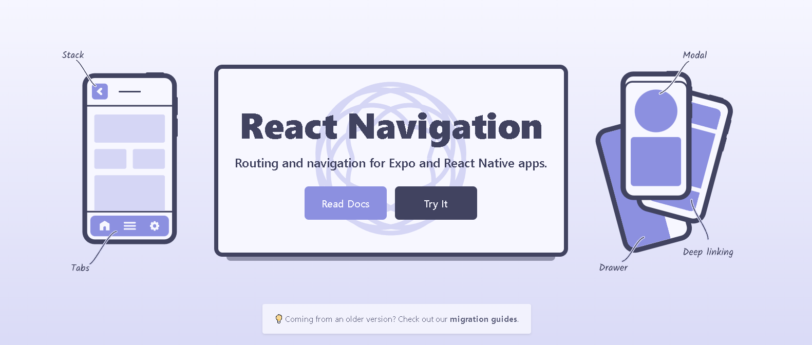

# Ignite Teams React Native
comandos de criação: npx create-expo-app igniteteams --template
comandos de inicialização do app: npx expo start

## styled-components
Biblioteca usada para fazer design de interfaces css

### comando de instalação.
npm install styled-components
npm install --save-dev @types/styled-components @types/styled-components-react-native
npm i styled-components@5.3.9


Extensão para instalar : vscode-styled-componentsv1.7.8

## babel-plugin-module-resolver
Foi usado para facilitar nas importações dos arquivos abreviando os caminhos.

babel.config.js

```tsx
module.exports = function(api) {
  api.cache(true);
  return {
    presets: ['babel-preset-expo'],
    plugins: [
      [
        'module-resolver',
        {
          root: ['./src'],
          alias: {
            '@assets': './src/assets',
            '@components': './src/components',
            '@routes': './src/routes',
            '@screens': './src/screens',
            '@storage': './src/storage',
            '@theme': './src/theme',
            '@utils': './src/utils',
          }
        }
      ]
    ]
  };
};
```

tsconfig.json
```tsx
{
  "compilerOptions": {
    "strict": true,
    "baseUrl": "./",
    "paths": {
      "@assets/*": [
        "./src/assets/*"
      ],
      "@components/*": [
        "./src/components/*"
      ],
      "@routes/*": [
        "./src/routes/*"
      ],
      "@screens/*": [
        "./src/screens/*"
      ],
      "@storage/*": [
        "./src/storage/*"
      ],
      "@theme/*": [
        "./src/theme/*"
      ],
      "@utils/*": [
        "./src/utils/*"
      ] 
  },
},
  "extends": "expo/tsconfig.base"
}
```

### comando de instalação.
npm install --save-dev babel-plugin-module-resolver

## Inserindo Fonts 
npm install expo-font @expo-google-fonts/roboto

expo install expo-font@10.0.4 expo-status-bar@1.2.0

## Library Icons Phosphor-react-native

### comando de instalação.
npm install --save phosphor-react-native

## Expo react-native-svg

npx expo install react-native-svg

## Expo react-navigation



Usamos para fazer navegações:
yarn add @react-navigation/native

Automatizações de configurações da navegação, detalhes animações etc..
expo install react-native-screens react-native-safe-area-context

Método de navegação stack(Pilha)
yarn add @react-navigation/native-stack

